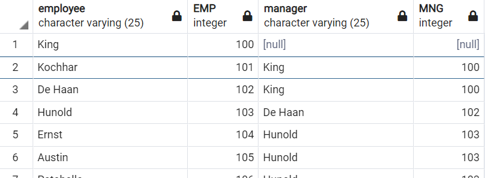
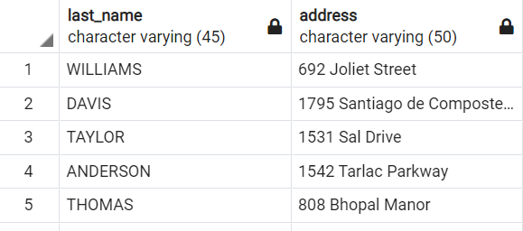
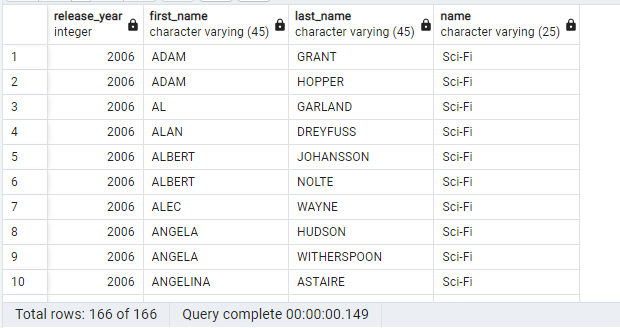
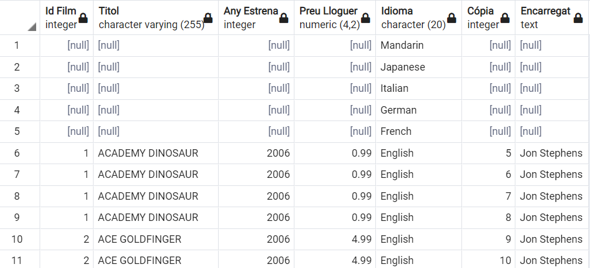

# A04 – Consulta de dades de vàries taules

## Descripció

## Aspectes a considerar

- Treballarem amb PostGreSQL i base de dades **HR** i **PAGILA**. 
- Pots crear els esquemes de la Base de Dades en el següent link: [Esquemes de Base de dades](https://github.com/sapa-basededades/M02-M10-Bases-de-Dades/tree/main/1%20-%20Llenguatge%20SQL%20DML%20i%20DDL/1%20-%20DATABASES/ESQUEMES/1%20-%20POSTGRES)
- Pots consultar el model relacional en el següent link:
  - [Pagila](https://github.com/sapa-basededades/M02-M10-Bases-de-Dades/blob/main/1%20-%20Llenguatge%20SQL%20DML%20i%20DDL/1%20-%20DATABASES/ESQUEMES/1%20-%20POSTGRES/08%20-%20Pagila/pagila-erm.png)
  - [HR]()

- Format d'entrega en pdf.
- No adjunteu captures de pantalla ni de la consulta ni amb els resultats.
- Les imatges son orientatives
- Només vull la sentencia SQL escrita (així en cas de dubte la puc copiar-enganxar i executar-la)

## Part 1. Base de dades HR (12 punts)

1. Mostra de cada empleat el seu codi, cognom, nom i nom del departament en el que treballa. Ordena les dades per codi empleat. (Taules implicades: employees, departments). (1 punt)

    

    (40 files)

2. Mostra de la taula dependents el seu codi, nom i cognom juntament amb el codi d'empleat, nom i cognom de l'empleat de qui és depenent (Taules implicades: employees, dependents) (1 punt)

    

    (30 files)

3. Mostra la mateixa informació que en la consulta anterior, però força a que surtin tots els empleats, encara que no tinguin dependent. (Taules implicades: employees, dependents) (1 punt)

    (40 files)

4. Mostra de cada departament, el codi, el nom de departament, el codi de localització, l'adreça, el codi postal i la ciutat on està ubicat. (Taules implicades: departments, locations) (1 punt)

    

    (11 files)

5. Mostra del departament de 'Marketing', el codi, el nom de departament, l'adreça, el codi postal i la ciutat. Per simplificar l'escriptura dona un alies a les taules ( per exemple d per departaments i l per localitzacions ). Utilitza el nom del departament per filtrar. (Taules implicades: departments, locations) (1 punt)

    

    (1 fila)

6. De les localitzacions amb codi 1400, 1700 i 2500, ens interessa saber el seu codi, la ciutat, l'estat de la província i el nom del país. Ordena per codi localització. (Taules implicades: locations, countries) (1 punt)

    

    (3 files)

7. Volem saber, dels empleats que van ser contractats abans del 1998 i que tenen un salari entre 10000 i 20000, quins pertanyen al departament de Vendes ( 'Sales' ) o de Comptes ( 'Accounting' ). Mostrar el codi empleat, nom, nom de departament, **any** de contractació i salari. Ordena les dades per nom de departament. (Taules implicades: employees, departments) (2 punts)

    

    (3 files)

8. Mostra els empleats que treballen (JOB\_TITLE) com a 'Programmer' o 'Sales' ( qualsevol 'Sales'). Volem saber el codi empleat, cognoms, el nom del treball, el seu salari, el salari mínim de la categoria a la que estan assignats i el nom del departament en el que treballen. Ordena les dades per JOB\_TITLE. (Taules implicades: employees, jobs i departments) (1 punt)

    

    (11 files)

9. Partint de la consulta anterior mostra només els que guanyen més de 1000 euros respecte el salari mínim. (Taules implicades: employees, jobs i departments) (1 punt)

    

    (6 files)

10. Mostra el cognom i el número d'empleat, junt amb el cognom i el número del seu director. Han de sortir tots els empleats encara que no tinguin assignat cap director. Etiqueteu les columnes Employee, EMP, Manager y MNG, respectivament. (2 punts)

    

    (40 files)

## Part 2. Bdd Pagila (11p)

11. Visualitza el cognom y el nom del carrer per a tots els clients que tinguin la lletra **a** en el cognom. (2 punts)

    

    (294 files)

12. Escriu una consulta per a mostrar el cognom del client, el nom del carrer, l'identificador de ciutat i el país de tots els clients de Japó. (2 punts)

    

    (31 files)

13. Crea un llistat únic dels actors que han participat en una pel·lícula de ciència ficció l'any 2006 (release\_year). (2 punts)

    

    (166 files)

14. Escriu una consulta per a visualitzar el número de còpia (inventory\_id), títol i codi de botiga (store\_id) d'aquelles còpies que no han estat llogades. (2 punts)

    (1 fila)

15. Mostra un llistat complert dels encarregats de les botigues, amb el codi, nom i cognom, email, i _ **adreça complerta** _, tal com es mostra en la captura. (2 punts)

    

    (2 files)

16. Mostra una consulta para visualitzar el codi de pel·lícula, el títol, l'any d'estrena, el preu del lloguer, l'idioma, el codi de còpia i el nom de l'encarregat. Ordena els resultats per idioma en ordre descendent, nom d'encarregat i codi de còpia. **Mostra tots els idiomes encara que no tinguin cap pel·lícula associada.** Etiqueta les columnes com es mostra a la imatge. (2 punts)

    

    (Us haurien de sortir 4628 files)
